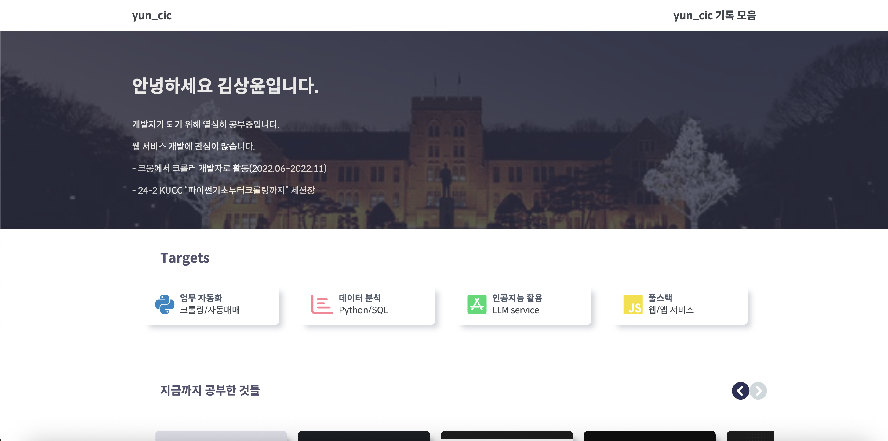
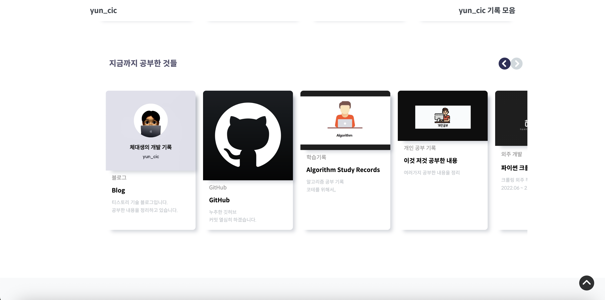
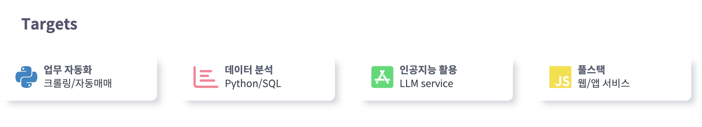
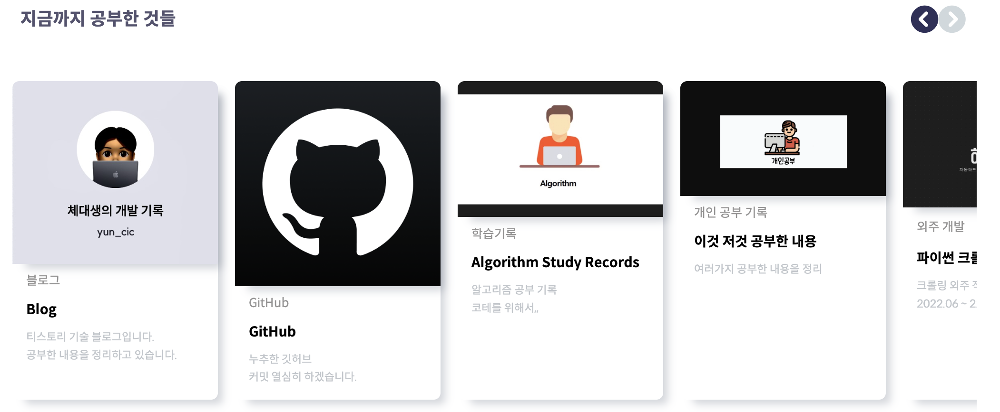
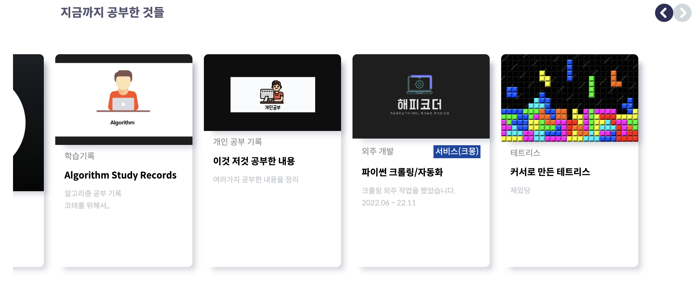
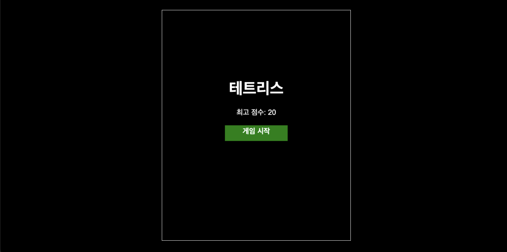
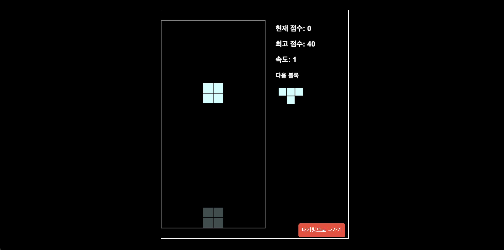
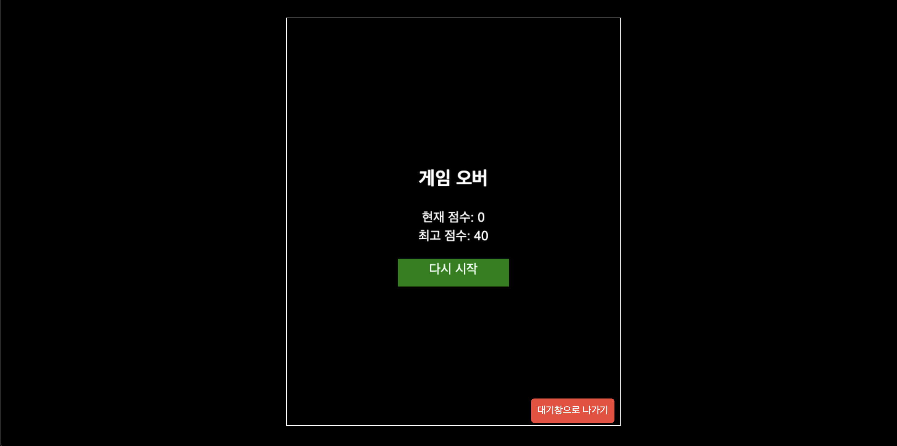

# IntroduceYun
## First page

## Scroll Down
### Bottom-To-Top with js

## Skill blocks

## Card List

## Card List's prev, next button with js

## Tetris with Pygame + HTML (Game Start Page)

## Playing Tetris

## Tetris Game OVer

